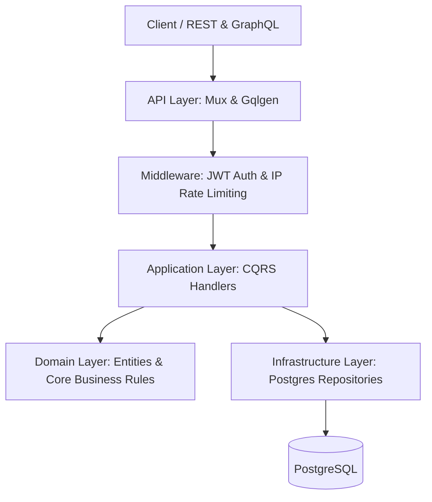

# Finance Tracker Backend

A high-performance, robust REST and GraphQL API for personal financial tracking, designed using Clean Architecture, CQRS, and Domain-Driven Design (DDD) principles in Go.

## Features

- **Dual APIs**: Exposes both a RESTful JSON API (via Gorilla Mux) and a GraphQL API (via gqlgen) offering unified business logic.
- **Clean Architecture & CQRS**: Separation of concerns across Domain, Application, and Infrastructure layers. Strict Command Query Responsibility Segregation separates state mutations from data retrieval operations.
- **Robust Security**: Built-in stateless JWT-based authentication via HTTP-only cookies, robust password hashing with `bcrypt`, and password strength validation.
- **Distributed Rate Limiting**: Intelligent token-bucket rate-limiting middleware to guard against abuse.
- **PostgreSQL Persistence**: Fully-featured Postgres repository layer with comprehensive indexing and structured database migrations (using `golang-migrate`).
- **Docker-Ready**: Packaged with a multi-stage Dockerfile and a complete `docker-compose.yml` for instantaneous local deployment.

## Architecture



### File Structure Overview

- `domain/`: Contains enterprise business rules, entities (`Expense`, `User`), and domain error models.
- `application/`: Application business rules, structured around CQRS (Commands and Queries) and Interfaces.
- `infrastructure/`: Implementations of repository interfaces, JWT auth providers, hash generation, and database migrations.
- `api/`: Transport layer detailing REST handlers, GraphQL resolvers, routing, and HTTP middleware.
- `cmd/`: Application entry point.

## Getting Started

### Prerequisites

- Go 1.22+
- PostgreSQL
- Docker & Docker Compose (optional, but recommended)

### Running Locally (Without Docker)

1. Clone this repository to your workspace.
2. Ensure Go and PostgreSQL are installed.
3. Configure your environment variables in a `.env` file (you can use the provided `.env` as a base).
4. Install dependencies:
   ```bash
   go mod tidy
   ```
5. Run the application (utilizes `air` for hot-reloading if you use `make run`):
   ```bash
   make run
   ```
   The API will be available at `http://localhost:8080`.

### Running with Docker

1. Ensure Docker and Docker Compose are installed.
2. Build and start the services:
   ```bash
   docker-compose up -d --build
   ```
3. The API will be available at `http://localhost:8080` and the Postgres instance will be bound to port `5432`.

## Documentation

Comprehensive API documentation is available in the `docs/` directory:

- [REST API Specifications](./docs/API_DEFINITION.md)
- [GraphQL API Schema](./docs/GRAPH_API_SCHEMA.md)
- [Database Design](./docs/DB_DESIGN.md)
- [Aggregate Design Concepts](./docs/AGGREGATE_DESIGN.md)

## Testing

Run the full test suite using:

```bash
make test
```

## Contributing

Pull requests are always welcome! For major changes, please open an issue first to discuss your proposed modifications. Ensure to update tests as appropriate.

## License

This project is licensed under the MIT License - see the [LICENSE](LICENSE) file for details.
